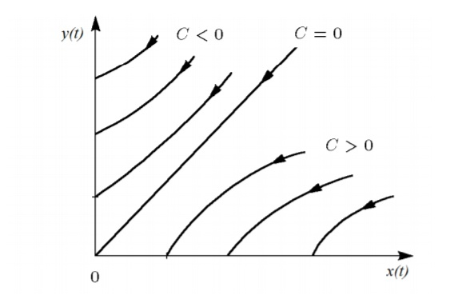
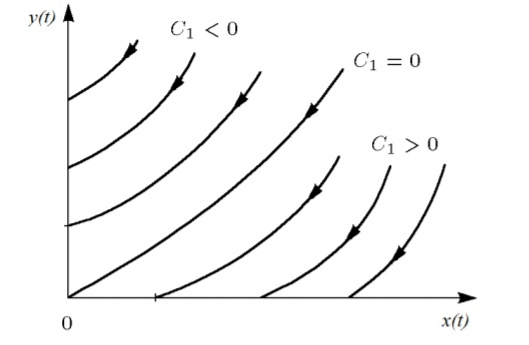
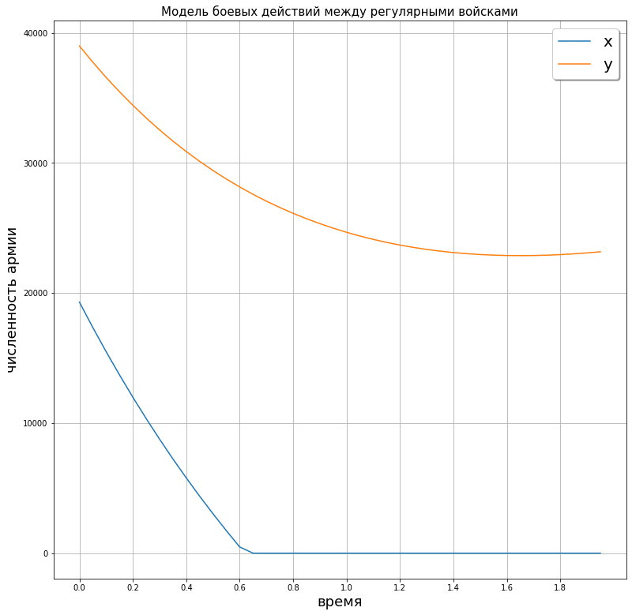
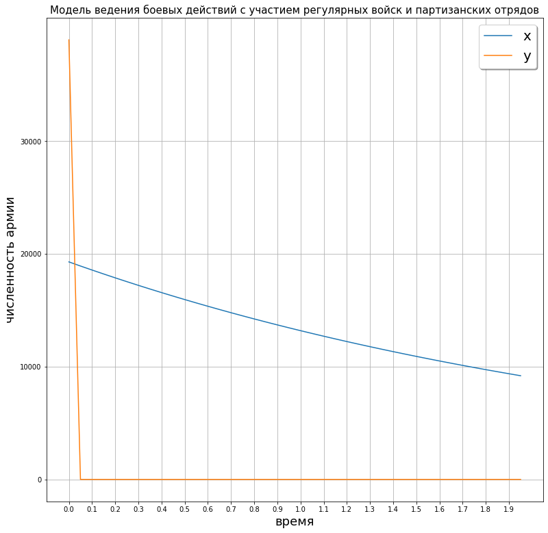

---
## Front matter
lang: ru-RU
title: Решение задач о погоне
date: 12 February, 2020

## Formatting
mainfont: Times New Roman
romanfont: Times New Roman
sansfont: Times New Roman
monofont: Times New Roman
toc: false
slide_level: 2
theme: metropolis
header-includes:
 - \metroset{progressbar=frametitle,sectionpage=progressbar,numbering=fraction}
 - '\makeatletter'
 - '\beamer@ignorenonframefalse'
 - '\makeatother'
aspectratio: 43
section-titles: true
---

# Модель боевых действий
## Простейшие модели боевых действий

* Рассмотрим некоторые простейшие модели боевых действий – модели Ланчестера.
* Если в какой-то момент времени одна из численностей обращается в нуль, то данная сторона считается проигравшей.

## Численность регулярных войск
Определяется тремя факторами:
* скорость уменьшения численности войск из-за причин, не связанных с боевыми действиями (болезни, травмы, дезертирство);
* скорость потерь, обусловленных боевыми действиями противоборствующих сторон (что связанно с качеством стратегии, уровнем вооружения, профессионализмом солдат и т.п.);
* скорость поступления подкрепления (задаётся некоторой функцией от времени).

## Так как же описать действия?
Для этого используем дифференциальные уровнения!
* $\frac{dx}{dt} = -a(t)x(t) - b(t)y(t) + P(t)$  
* $\frac{dy}{dt} = -c(t)x(t) - h(t)y(t) + Q(t)$,
  где $-a(t)x(t)$ и $-c(t)x(t)$ описывают солдат,
      а $-b(t)y(t)$ и $-h(t)y(t)$ отображают потери в бою,
      $P(t)$ и $Q(t)$ мощь армии.

## Как понять, кто выигрывает и проигрывает?
*Эволюция численности армий $x$ и $y$ проходит вдоль гиперболы, заданной этим уравнением (рис. -@fig:001).

{#fig:001 width=50%}

* Эти гиперболы разделены прямой $\sqrt{c} x = \sqrt{b}y$. Если начальная точка лежит выше этой прямой, армия $y$ выигрывает.

## Как понять, кто выигрывает и проигрывает?
Если рассматривать второй случай (война между регулярными войсками и
партизанскими отрядами) с теми же упрощениями, то модель принимает вид:
$\frac{d}{dt} (\frac{b}{2}x^{2}(t) - cy(t)) = 0$

{#fig:002 width=50%}

Из рис. -@fig:002 видно, что при $C_{1} > 0$ побеждает регулярная армия, при $C_{1} < 0$ побеждают партизаны.
Чтобы одержать победу, партизанам необходимо увеличть коэффициент $c$ и повысить свою начальную численность
на соответствующую величину. Причем это увеличение, с ростом начальной численности регулярных войск $(x(0))$,
должно расти не линейно, а пропорционально второй степени $x(0)$.

## Выполнение задачи
Мой варинтом стала цифра 8
Если все решить, то получиться следущая картина

## Первая модель
На рис. -@fig:003 показан график изменения численности армий в первой модели

{#fig:003 width=50%}

Как видно из рисунка, в момент времени t = 0.65 армия $Y$ уничтожила армию $X$.

## Вторая модель
На рис. -@fig:004 показан график изменения численности армий во второй модели

{#fig:004 width=50%}

Из рисунка видно, что уже к моменту времени t = 0.05 регулярная армия X уничтожила партизанские отряды

## Спасибо за внимание
> Панкратьев Александр НФИбд-02-18
