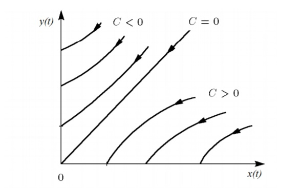
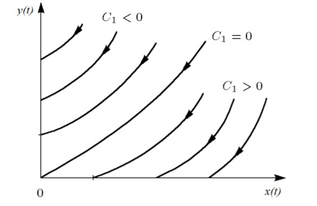
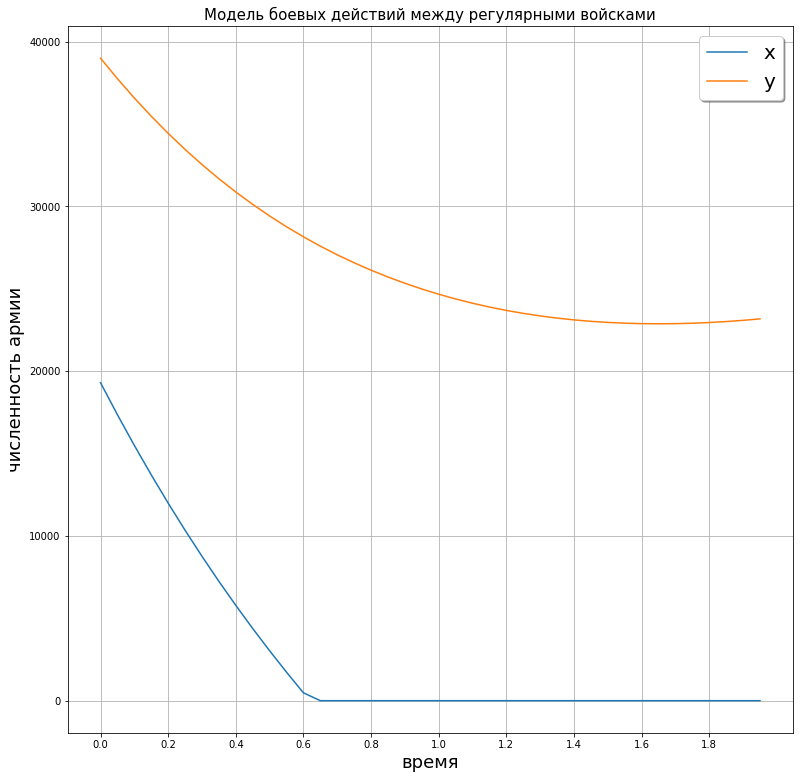
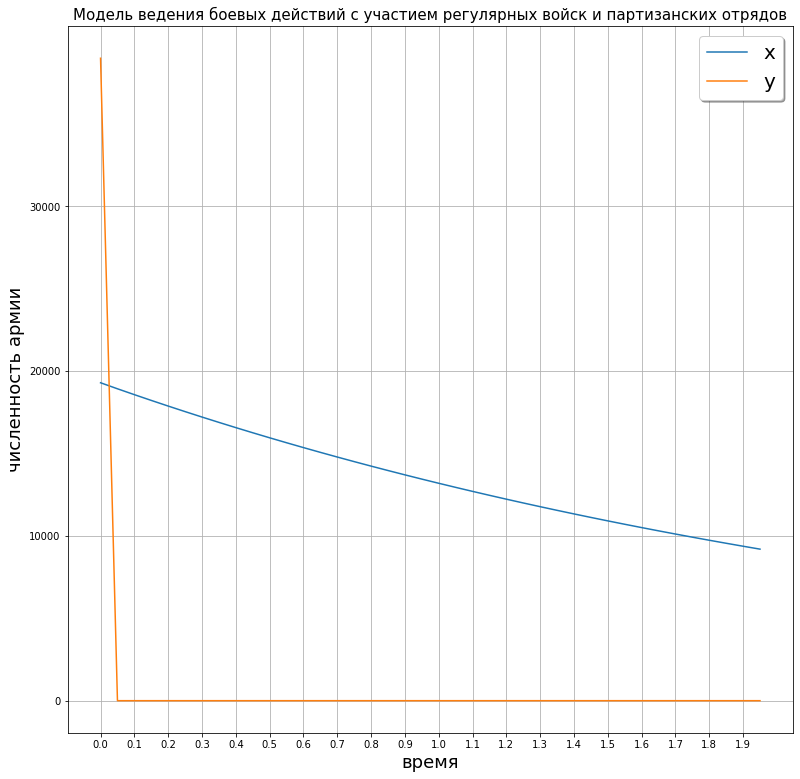

---
# Front matter
lang: ru-RU
title: "Отчёт по лабораторной работе"
subtitle: "Лабораторная №1"
author: "Панкратьев Александр Владимироваич"

# Formatting
toc-title: "Содержание"
toc: true # Table of contents
toc_depth: 2
lof: true # List of figures
lot: true # List of tables
fontsize: 12pt
linestretch: 1.5
papersize: a4paper
documentclass: scrreprt
polyglossia-lang: russian
polyglossia-otherlangs: english
mainfont: Times New Roman
romanfont: Times New Roman
sansfont: Times New Roman
monofont: Times New Roman
mainfontoptions: Ligatures=TeX
romanfontoptions: Ligatures=TeX
sansfontoptions: Ligatures=TeX,Scale=MatchLowercase
monofontoptions: Scale=MatchLowercase
indent: true
pdf-engine: lualatex
header-includes:
  - \linepenalty=10 # the penalty added to the badness of each line within a paragraph (no associated penalty node) Increasing the value makes tex try to have fewer lines in the paragraph.
  - \interlinepenalty=0 # value of the penalty (node) added after each line of a paragraph.
  - \hyphenpenalty=50 # the penalty for line breaking at an automatically inserted hyphen
  - \exhyphenpenalty=50 # the penalty for line breaking at an explicit hyphen
  - \binoppenalty=700 # the penalty for breaking a line at a binary operator
  - \relpenalty=500 # the penalty for breaking a line at a relation
  - \clubpenalty=150 # extra penalty for breaking after first line of a paragraph
  - \widowpenalty=150 # extra penalty for breaking before last line of a paragraph
  - \displaywidowpenalty=50 # extra penalty for breaking before last line before a display math
  - \brokenpenalty=100 # extra penalty for page breaking after a hyphenated line
  - \predisplaypenalty=10000 # penalty for breaking before a display
  - \postdisplaypenalty=0 # penalty for breaking after a display
  - \floatingpenalty = 20000 # penalty for splitting an insertion (can only be split footnote in standard LaTeX)
  - \raggedbottom # or \flushbottom
  - \usepackage{float} # keep figures where there are in the text
  - \floatplacement{figure}{H} # keep figures where there are in the text
---

# Цель работы

Рассмотреть модели боевых действий - модели ланчестера. Вариант 8.

# Задание

Между страной Х и страной У идет война.
Численность состава войск исчисляется от начала войны, и являются временными функциями $x(t)$ и $y(t)$.
В начальный момент времени страна $Х$ имеет армию численностью $895 000$ человек,а в распоряжении страны $У$ армия численностью в $577 000$ человек.
Для упрощения модели считаем, что коэффициенты $a, b, c, h$ постоянны. Также считаем $P(t) и $Q(t)$ непрерывными функциями.  

Необходимо построить графики изменения численности войск армии Х и армии У для следующих случаев:

1.  Модель боевых действий между регулярными войсками.

$\frac{dx}{dt}=-a(t)x(t)-b(t)y(t)+P(t)$  
$\frac{dy}{dt}=-c(t)x(t)-h(t)y(t)+Q(t)$

Где $a = 0,3, b=0,87, c=0,5, h=0,41, P(t)=sin(1,5*t), Q(t)=cos(0,5*t)+3$

2.  Модель ведения боевых действий с участием регулярных войск и
партизанских отрядов

$\frac{dx}{dt}=-a(t)x(t)-b(t)y(t)+P(t)$  
$\frac{dy}{dt}=-c(t)x(t)y(t)-h(t)y(t)+Q(t)$

Где $a = 0,38, b=0,73, c=0,5, h=0,28, P(t)=sin(2*t)+1, Q(t)=cos(2*t)$

# Теоретическая справка

В общем случае главной характеристикой соперников
являются численности сторон. Если в какой-то момент времени одна из
численностей обращается в нуль, то данная сторона считается проигравшей (при
условии, что численность другой стороны в данный момент положительна).

В случае, когда боевые  действия идут между регулярными войсками, модель описывается следующим образом:

$\frac{dx}{dt} = -a(t)x(t) - b(t)y(t) + P(t)$  
$\frac{dy}{dt} = -c(t)x(t) - h(t)y(t) + Q(t)$

Потери, не связанные с боевыми действиями, описывают члены $-a(t)x(t)$ и $-h(t)y(t)$,
члены $-b(t)y(t)$ и $-c(t)x(t)$ отражают потери на поле боя. Функции $P(t), Q(t)$ учитывают
возможность подхода подкрепления к войскам $X$ и $Y$ в течение одного дня.

В случае, когда боевые действия идут с участием регулярных войск и партизанских отрядов считается, что
темп потерь партизан, проводящих свои операции в разных местах на некоторой известной территории, пропорционален
не только численности армейских соединений, но и численности самих партизан. В результате модель принимает вид:

$\frac{dx}{dt} = -a(t)x(t) - b(t)y(t) + P(t)$  
$\frac{dy}{dt} = -c(t)x(t)y(t) - h(t)y(t) + Q(t)$

В этой системе все величины имеют тот же смысл, что и в первой системе.

В простейшей модели борьбы предполагается, что каждый солдат армии $x$ убивает за единицу времент $c$ солдат
армии $y$ (и, соответственно, каждый солдат армии $y$ убивает $b$ солдат армии $x$). Состояние системы
описывается точкой $(x,y)$ положительного квадранта плоскости. Координаты этой точки, $x$ и $y$ - это численности
противостоящих армий. Тогда модель принимает вид:

$\begin{cases} \dot{x} = -by\\\dot{y} = -cx \end{cases}$

Это - жесткая модель, которая допускает точное решение

$\frac{dx}{dy} = \frac{by}{cx}$  

$cxdx = bydy, cx^(2)-by^(2) = C$

Эволюция численности армий $x$ и $y$ проходит вдоль гиперболы, заданной этим уравнением (рис. -@fig:001).

{#fig:001 width=70%}

Эти гиперболы разделены прямой $\sqrt{c} x = \sqrt{b}y$. Если начальная точка лежит выше этой прямой, армия $y$ выигрывает.
Если начальная точка лежит ниже, выигрывает армия $x$.
В разделяющем эти случаи состоянии (на прямой) война заканчивается истреблением обеих армий.

Вывод модели таков: для борьбы с вдвое более многочисленным
противником нужно в четыре раза более мощное оружие, с втрое более
многочисленным - в девять раз и т. д. (на это указывают квадратные корни в
уравнении прямой).

Если рассматривать второй случай (война между регулярными войсками и
партизанскими отрядами) с теми же упрощениями, то модель принимает вид:

$\begin{cases} \frac{dx}{dt} = -by(t)\\\frac{dy}{dt}=-cx(t)y(t) \end{cases}$

Эта система приводится к уравнению:

$\frac{d}{dt} (\frac{b}{2}x^{2}(t) - cy(t)) = 0$

Оно имеет единственное решение при заданных начальных условиях:

$\frac{b}{2}x^{2}(t) - cy(t) = \frac{b}{2}x^{2}(0) - cy(0)) = C_{1}$

{#fig:002 width=70%}

Из рис. -@fig:002 видно, что при $C_{1} > 0$ побеждает регулярная армия, при $C_{1} < 0$ побеждают партизаны.
Чтобы одержать победу, партизанам необходимо увеличть коэффициент $c$ и повысить свою начальную численность
на соответствующую величину. Причем это увеличение, с ростом начальной численности регулярных войск $(x(0))$,
должно расти не линейно, а пропорционально второй степени $x(0)$. Таким образом, можно сделать вывод, что
регулярные войска находятся в более выгодном положении, так как неравенство для них выполняется при меньшем
росте начальной численности войск.

Рассмотренные простейшие модели соперничества соответствуют системам
обыкновенных дифференциальных уравнений второго порядка, широко
распространенным при описании многих естественно научных объектов.

# Выполнение лабораторной работы

Для работы я использовал язык Python. Я задал необходимые начальные параметры и определил функции P(t) и Q(t).
Написал функцию, которая описывает систему дифференциальных уравнений. Для решения
системы использовала функцию solve_ivp() из библиотеки scipy.

## Первая модель

На рис. -@fig:003 показан график изменения численности армий в первой модели

{#fig:003 width=70%}

Как видно из рисунка, в момент времени t = 0.65 армия $Y$ уничтожила армию $X$.

## Вторая модель

На рис. -@fig:004 показан график изменения численности армий во второй модели

{#fig:004 width=70%}

Из рисунка видно, что уже к моменту времени t = 0.05 регулярная армия X уничтожила партизанские отряды

# Вывод

Я построил и проанализировал модели боевых действий, научился решать системы дифференциальных уравнений на языке Python.
