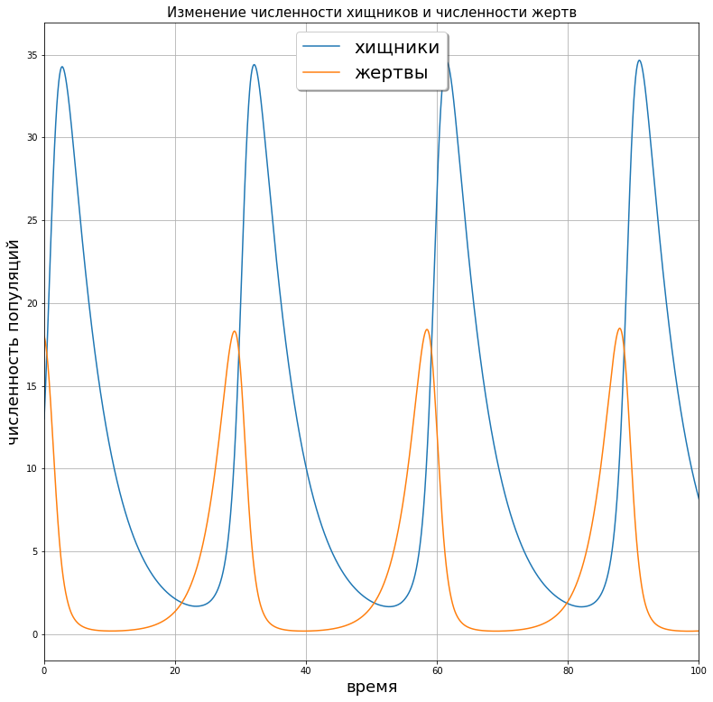
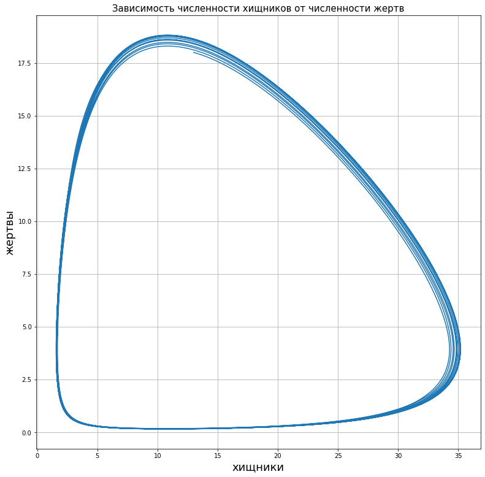
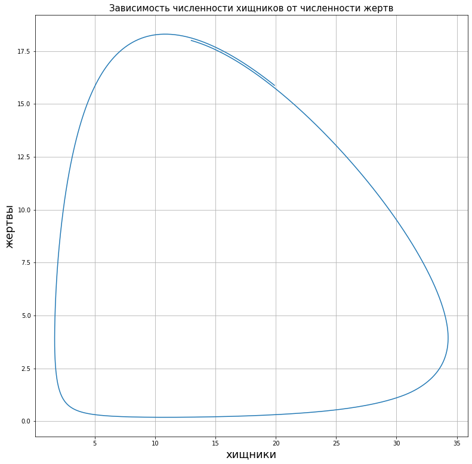

---
## Front matter
lang: ru-RU
title: Решение задач о погоне
author: |
	 Панкратьев Александр Владимироваич НФИбд-02-18\inst{1}

institute: |
	\inst{1}Российский Университет Дружбы Народов
date: 12 February, 2020

## Formatting
mainfont: Times New Roman
romanfont: Times New Roman
sansfont: Times New Roman
monofont: Times New Roman
toc: false
slide_level: 2
theme: metropolis
header-includes:
 - \metroset{progressbar=frametitle,sectionpage=progressbar,numbering=fraction}
 - '\makeatletter'
 - '\beamer@ignorenonframefalse'
 - '\makeatother'
aspectratio: 43
section-titles: true
---

## Цель работы

Цель данной лабораторной работы - ознакомиться с моделью типа "хищник-жертва" - моделью Лотки-Вольтерры.

## Задачи лабораторной работы  

Задачей данной лабораторной работы было построить графики данной модели:

1. График изменения численности хищников и жертв.
2. График зависимости численности хищников от численности жертв.
3. График стационарного состояния системы.

## Модель

$\begin{cases} \frac{dx}{dt}=-ax(t)+bx(t)y(t)\\\frac{dy}{dt}=cy(t)-dx(t)y(t) \end{cases}$

Коэффициент $c$ описывает скорость естественного прироста числа жертв в отсутствие хищников

$a$ - естественное вымирание хищников, лишенных пищи в виде жертв

Вероятностьвзаимодействия жертвы и хищника считается пропорциональной как количеству
жертв, так и числу самих хищников ($xy$). Каждый акт взаимодействия уменьшает
популяцию жертв, но способствует увеличению популяции хищников (члены $bxy$
и $-dxy$ в правой части уравнения).

# Результаты

## График изменения численности хищников и жертв.

{#fig:001 width=70%}

## График зависимости численности хищников от численности жертв.

{#fig:002 width=70%}

## График стационарного состояния системы.

{#fig:003 width=70%}

## Выводы

Я изучил модель "хищник-жертва", проанализировал изменение двух популяций в зависимости от времени и друг друга.
