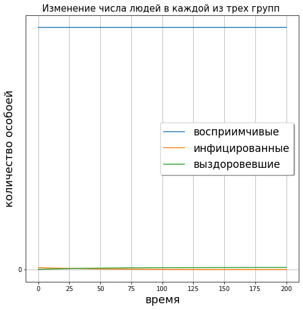
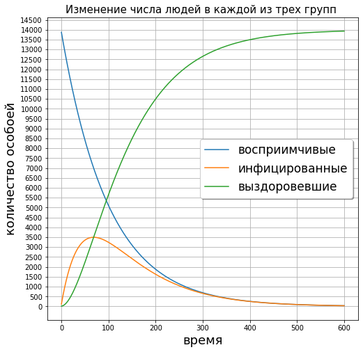

---
## Front matter
lang: ru-RU
title: Решение задач о погоне
author: |
	 Панкратьев Александр Владимироваич НФИбд-02-18\inst{1}

institute: |
	\inst{1}Российский Университет Дружбы Народов
date: 12 February, 2020

## Formatting
mainfont: Times New Roman
romanfont: Times New Roman
sansfont: Times New Roman
monofont: Times New Roman
toc: false
slide_level: 2
theme: metropolis
header-includes:
 - \metroset{progressbar=frametitle,sectionpage=progressbar,numbering=fraction}
 - '\makeatletter'
 - '\beamer@ignorenonframefalse'
 - '\makeatother'
aspectratio: 43
section-titles: true
---

# Задание

На одном острове вспыхнула эпидемия. Известно, что из всех проживающих на острове $N=14000 $ в момент начала эпидемии $t=0$ число заболевших людей (являющихся распространителями инфекции) $I(0)=114$, а число здоровых людей с иммунитетом к болезни $R(0)=14$. Таким образом, число людей восприимчивых к
болезни, но пока здоровых, в начальный момент времени $S(0)=N-I(0)- R(0)$.
Построить графики изменения числа особей в каждой из трех групп.
Рассмотреть, как будет протекать эпидемия в случае:
1) если $I(0)\leq I^*$
2) если $I(0)> I^*$

## Первый случай

Случай, когда число заболевших не превышает критического значения $I^{*}$, считаем, что все больные
изолированны и не заражают здоровых.

На рис. -@fig:001 показан график изменения численности трех групп

{#fig:001 width=70%}

## Второй случай.

Во втором случае $I(t) > I^{*}$ и инфицированные способны заражать восприимчивых
к болезни особей. На рис. -@fig:002 показан график изменения чисенности трех групп

{#fig:002 width=70%}

# Вывод

Я построил и проанализировал модель эпидемии для двух случаев, когда инфицированные изолированы
и когда происходит заражение восприимчивых.
