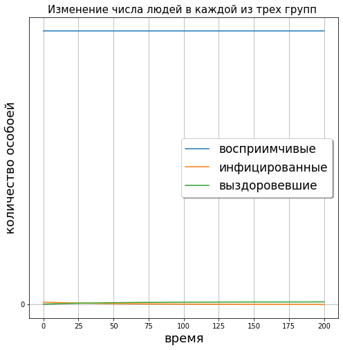
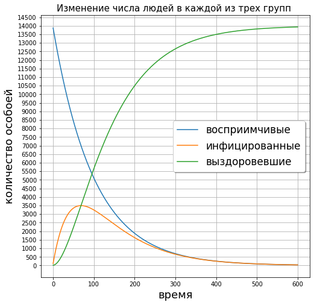

---
# Front matter
lang: ru-RU
title: "Отчёт по лабораторной работе"
subtitle: "Лабораторная №1"
author: "Панкратьев Александр Владимироваич"

# Formatting
toc-title: "Содержание"
toc: true # Table of contents
toc_depth: 2
lof: true # List of figures
lot: true # List of tables
fontsize: 12pt
linestretch: 1.5
papersize: a4paper
documentclass: scrreprt
polyglossia-lang: russian
polyglossia-otherlangs: english
mainfont: Times New Roman
romanfont: Times New Roman
sansfont: Times New Roman
monofont: Times New Roman
mainfontoptions: Ligatures=TeX
romanfontoptions: Ligatures=TeX
sansfontoptions: Ligatures=TeX,Scale=MatchLowercase
monofontoptions: Scale=MatchLowercase
indent: true
pdf-engine: lualatex
header-includes:
  - \linepenalty=10 # the penalty added to the badness of each line within a paragraph (no associated penalty node) Increasing the value makes tex try to have fewer lines in the paragraph.
  - \interlinepenalty=0 # value of the penalty (node) added after each line of a paragraph.
  - \hyphenpenalty=50 # the penalty for line breaking at an automatically inserted hyphen
  - \exhyphenpenalty=50 # the penalty for line breaking at an explicit hyphen
  - \binoppenalty=700 # the penalty for breaking a line at a binary operator
  - \relpenalty=500 # the penalty for breaking a line at a relation
  - \clubpenalty=150 # extra penalty for breaking after first line of a paragraph
  - \widowpenalty=150 # extra penalty for breaking before last line of a paragraph
  - \displaywidowpenalty=50 # extra penalty for breaking before last line before a display math
  - \brokenpenalty=100 # extra penalty for page breaking after a hyphenated line
  - \predisplaypenalty=10000 # penalty for breaking before a display
  - \postdisplaypenalty=0 # penalty for breaking after a display
  - \floatingpenalty = 20000 # penalty for splitting an insertion (can only be split footnote in standard LaTeX)
  - \raggedbottom # or \flushbottom
  - \usepackage{float} # keep figures where there are in the text
  - \floatplacement{figure}{H} # keep figures where there are in the text
---

# Цель работы

Ознакомиться с задачей об эпидемии, рассмотреть ее модель и построить графики по этой модели.

# Задание

На одном острове вспыхнула эпидемия. Известно, что из всех проживающих на острове $N=14000 $ в момент начала эпидемии $t=0$ число заболевших людей (являющихся распространителями инфекции) $I(0)=114$, а число здоровых людей с иммунитетом к болезни $R(0)=14$. Таким образом, число людей восприимчивых к
болезни, но пока здоровых, в начальный момент времени $S(0)=N-I(0)- R(0)$.
Построить графики изменения числа особей в каждой из трех групп.
Рассмотреть, как будет протекать эпидемия в случае:
1) если $I(0)\leq I^*$
2) если $I(0)> I^*$

# Теоретическая справка

В рассматриваемой модели существуют три группы: восприимчивые - $S(t)$, инфицированные - $I(t)$ и особи
с иммунитетом - $R(0)$.

До того, как число заболевших не превышает критического значения $I^{*}$, считаем, что все больные
изолированны и не заражают здоровых. Когда $I(t) > I^{*}$, тогда инфицированные способны заражать восприимчивых
к болезни особей.

Таким образом, скорость изменения числа $S(t)$ меняется по закону:

$\frac{dS}{dt}=\begin{cases} -aS, если I(t)>I^{*} \\ 0, если I(t)<=I^{*} \end{cases}$

Поскольку каждая восприимчивая к болезни особь, которая, в конце концов,
заболевает, сама становится инфекционной, то скорость изменения числа
инфекционных особей представляет разность за единицу времени между
заразившимися и теми, кто уже болеет и лечится, т.е.:

$\frac{dI}{dt}=\begin{cases} -aS - bI, если I(t)>I^{*} \\ -bI, если I(t)<=I^{*} \end{cases}$

А скорость изменения выздоравливающих особей (при этом приобретающие
иммунитет к болезни):

$\frac{dI}{dt}=bI$

Постоянные пропорциональности
a, b, - это коэффициенты заболеваемости
и выздоровления соответственно.

# Выполнение лабораторной работы

Для работы я использовала язык Python. Я задала необходимые начальные параметры и определила
системы дифференциальных уравнений, описывающие изменение популяций.
Для решения системы использовала функцию solve_ivp() из библиотеки scipy.

## Первый случай

Случай, когда число заболевших не превышает критического значения $I^{*}$, считаем, что все больные
изолированны и не заражают здоровых.

На рис. -@fig:001 показан график изменения численности трех групп

{#fig:001 width=70%}

Для более наглядного результат я установил общее количество популяции равным 2000. Как видно из рисунка, численность группы восприимчивых не изменяется, численность инфицированных уменьшается, а
численность выздоровевших увеличивается.

## Второй случай.

Во втором случае $I(t) > I^{*}$ и инфицированные способны заражать восприимчивых
к болезни особей. На рис. -@fig:002 показан график изменения чисенности трех групп

{#fig:002 width=70%}

Как видно из рисунка, число восприимчивых резко уменьшается и доходит до нуля,
так как люди начинают заболевать. Число выздоровевших резко увеличивается и доходит до количества
всей популяции. Число инфицированных сначала быстро растет, но с уменьшением количества
инфицированных постепенно падает и доходит до нуля.

# Вывод

Я построил и проанализировал модель эпидемии для двух случаев, когда инфицированные изолированы
и когда происходит заражение восприимчивых.
